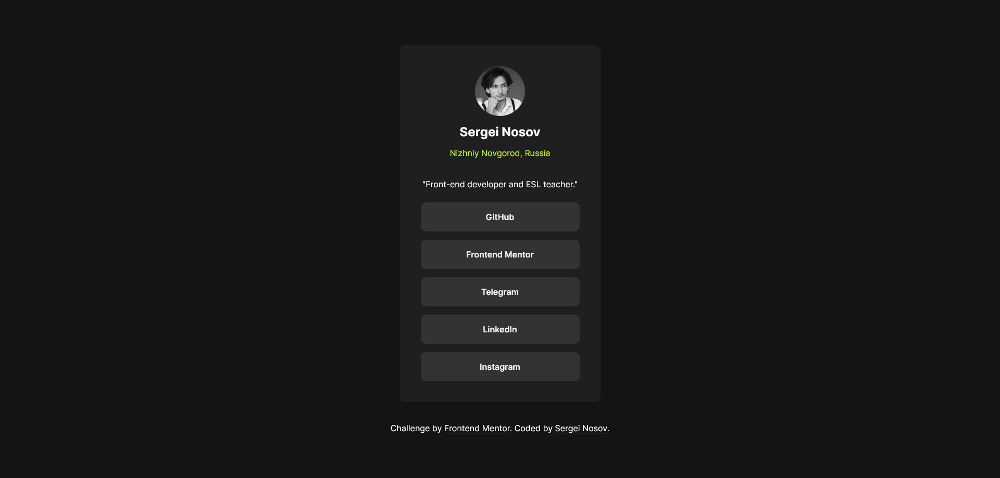
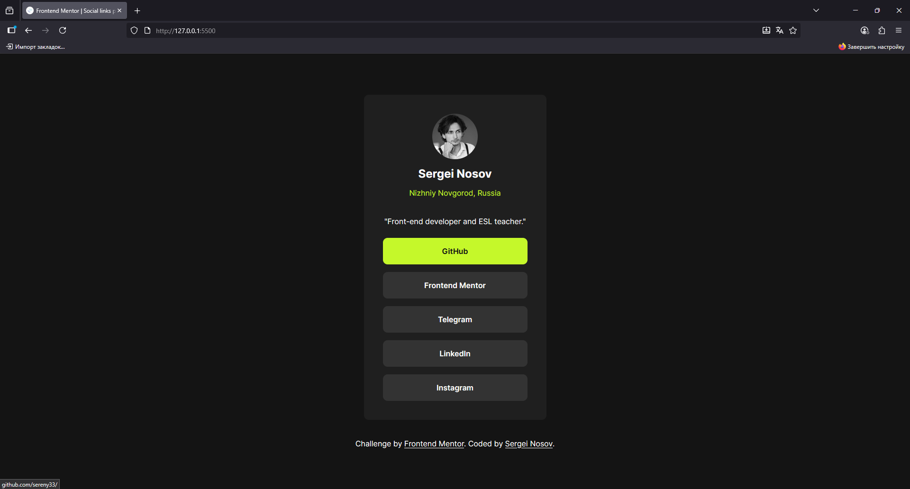

# Frontend Mentor - Blog preview card solution

This is a solution to the [Social links profile challenge on Frontend Mentor](https://www.frontendmentor.io/challenges/social-links-profile-UG32l9m6dQ). Frontend Mentor challenges help you improve your coding skills by building realistic projects. 

## Table of contents

- [Overview](#overview)
  - [The challenge](#the-challenge)
  - [Screenshot](#screenshot)
  - [Links](#links)
- [My process](#my-process)
  - [Built with](#built-with)
  - [What I learned](#what-i-learned)
  - [Continued development](#continued-development)
  - [Useful resources](#useful-resources)
- [Author](#author)
- [Acknowledgments](#acknowledgments)

## Overview

### Screenshot

### The challenge

Users should be able to:

- See hover and focus states for all interactive elements on the page

### Links

- Solution URL: [Solution URL here](https://github.com/sereny33/blog-preview-card-main)
- Live Site URL: [Live site URL here](https://sereny33.github.io/blog-preview-card-main/)

## My process

### Built with

- Semantic HTML5 markup
- CSS custom properties
- Flexbox
- Adaptive typography using clamp()
- CSS pseudo-elements (::after) for hover effects

🧠 Flexbox Practice

I used Flexbox to organize the layout of the card’s sections (image, content, author).

## Author

- GitHub - [Sergei Nosov](https://github.com/sereny33/)
- Frontend Mentor - [@sereny33](https://www.frontendmentor.io/profile/sereny33)
- Telegram - [@serenysereny](https://t.me/serenysereny)
